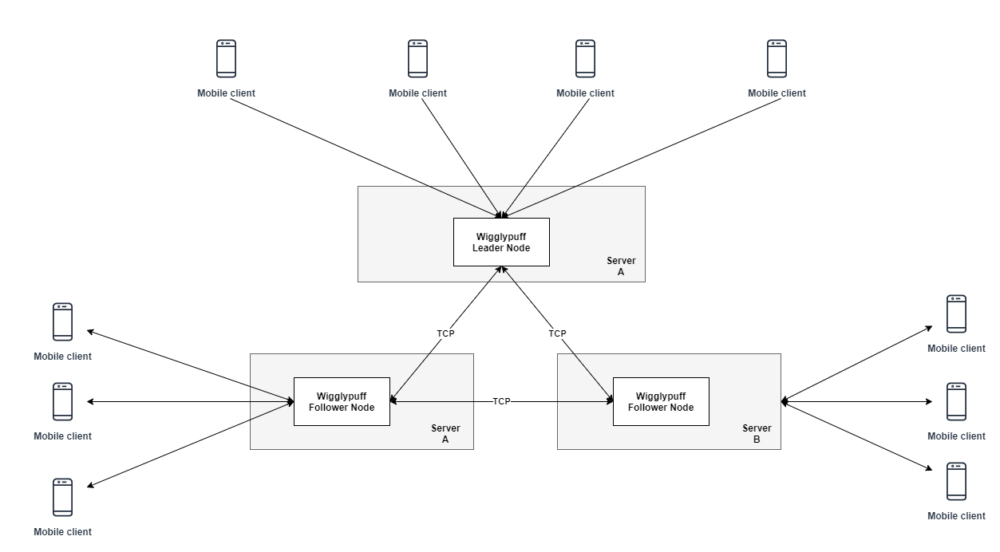
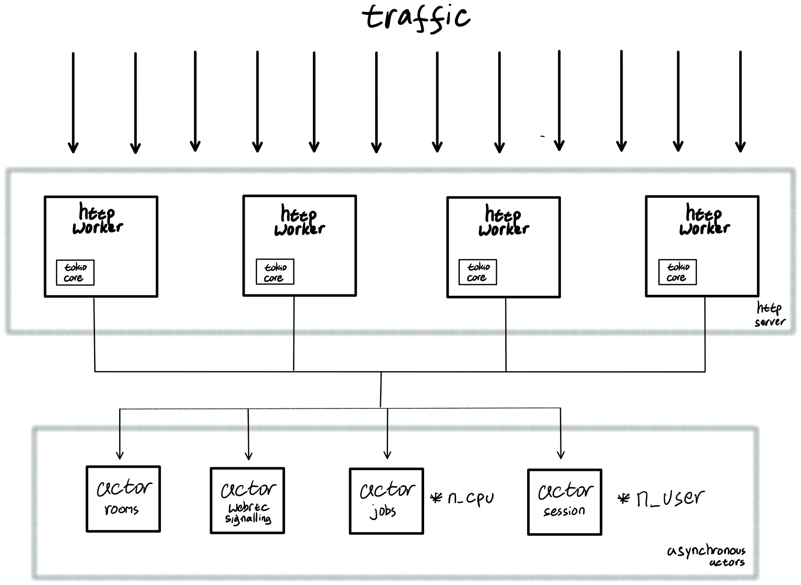
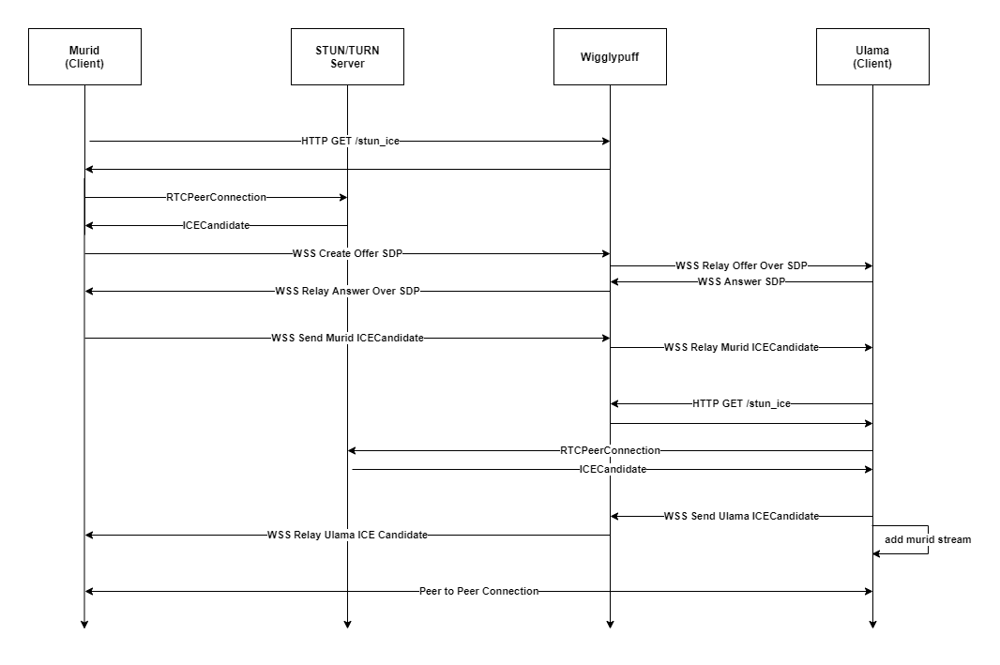

# wigglypuff
distributed websocket &amp; webrtc media server

# How To Run (Development Mode)
```
docker build -t wigglypuff .
docker run --rm -v "$YOUR_WORKSPACE_PATH:/app" -it -p 6030:6030 -e HOST=0.0.0.0 -e PORT=6030 wigglypuff bash
$ cargo run
```

# Design Proposals


# Concurrency Design


# Mobile Client


# API Contract
1. HTTP GET STUN/TURN Server
```
# Endpoint: {url}/network_transversal
# Content-Type: application/json
# Status-Code: 200 OK

{
    "success": true,
    "data": {
        "stun": {
            "address": str
        },
        "turn": [
            {
                "address": str
                "username": str
                "credential": str
            },
            ...
        ]
    }
}
```
2. HTTP POST Create Room Channel & Websocket Room by Name

### request
```
# Endpoint: {url}/api/room/create
# Content-Type: application/json

{
	"name": str,
	"master_uuid": str
}
```

### response
```
# Content-Type: application/json
# Status-Code: 200 OK

{
    "success": true,
    "data": "room created"
}
```

3. HTTP GET All Room Channel

### response
```
# Endpoint: {url}/api/room/all
# Content-Type: application/json
# Status-Code: 200 OK

{
    "success": true,
    "data": [
        str,
        ...
    ]
```

4. HTTP POST Delete Room Channel & Websocket Room by Name

### request
```
# Endpoint: {url}/api/room/delete
# Content-Type: application/json

{
	"name": str
}
```

### response
```
# Content-Type: application/json
# Status-Code: 200 OK

{
    "success": true,
    "data": "room deleted"
}
```

5. HTTP POST Kick User in Room Channel

### request
```
# Endpoint: {url}/api/room/delete
# Content-Type: application/json
{
	"uuid": str,
	"room_name": str
}
```

### response
```
# Content-Type: application/json
# Status-Code: 200 OK
{
    "success": true,
    "data": "user kicked"
}
```

6. HTTP GET Firebase Cloud Messaging Server Token
### response
```
# Endpoint: {url}/api/room/delete
# Content-Type: application/json
{
    "success": true,
    "data": {
        "token": str
    }
}
```

7. Websocket Join Room
```
# Role: All
# Endpoint: {url}/api/room/join/$room_name/$uuid
# Event on User in $room_name
{
    "action": "NewUser",
    "uuid": str
}
```

8. Websocket Leave Room
```
# Role: All
# Event on User in $room_name
{
    "action": "UserLeave",
    "uuid": str
}
```

9. Websocket Click Aya
```
# Role: Room Master
# Event to send in Wigglypuff Server
{
    "action": "ClickAya", 
    "aya": int
}
# Event on receive User in $room_name
{
    "action": "UserLeave",
    "uuid": str
}
```

10. Websocket Offer Correction
```
# Role: User in Room
# Event to send in Wigglypuff Server
{
    "action": "OfferCorrection", 
    "uuid": str
}
# Event on receive Room Master in $room_name
{
    "action": "OfferCorrection", 
    "uuid": str
}
```

11. Websocket Answer Correction
```
# Role: Room Master
# Event to send in Wigglypuff Server
{
    "action": "AnswerCorrection", 
    "uuid": str
    "result": bool
}
# Event on receive User with specific uuid
{
    "action": "AnswerCorrection", 
    "uuid": str
    "result": bool
}
```

12. Websocket Mute User in Room
```
# Role: Room Master
# Event to send in Wigglypuff Server
{
    "action": "MuteUser", 
    "uuid": str
    "result": bool
}
# Event on receive User with specific uuid
{
    "action": "MuteUser", 
    "uuid": str
}
```

13. Websocket Mute All User in Room
```
# Role: Room Master
# Event to send in Wigglypuff Server
{
    "action": "MuteAll", 
}
# Event on receive User with specific uuid
{
    "action": "MuteAll", 
}
```

14. Websocket Move Sura
```
# Role: Room Master
# Event to send in Wigglypuff Server
{
    "action": "MuteAll", 
    "id_quran" int
}
# Event on receive User with specific uuid
{
    "action": "MuteAll", 
    "id_quran" int
}
```