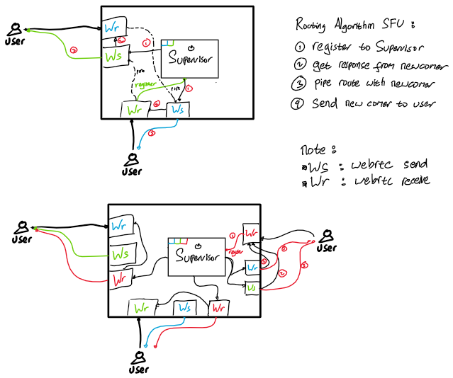

# Wigglypuff
Webrtc signalling & media server

# Media Server

# Mobile Client Flow

## Contribution guidelines

**If you want to contribute to Wigglypuff, be sure to review the
[contribution guidelines](CONTRIBUTING.md). This project adheres to Wigglypuff's
[code of conduct](CODE_OF_CONDUCT.md). By participating, you are expected to
uphold this code.**

**We use [GitHub issues](https://github.com/cQuran/wigglypuff/issues) for
tracking requests and bugs, please see
[Wigglypuff Discuss](https://cquran.slack.com/apps)
for general questions and discussion, and please direct specific questions to
[Slack Channel](https://cquran.slack.com/apps).

**We appreciate all contributions. If you are planning to contribute back bug-fixes, please do so without any further discussion.**

**If you plan to contribute new features, utility functions, or extensions to the core, please first open an issue and discuss the feature with us. Sending a PR without discussion might end up resulting in a rejected PR because we might be taking the core in a different direction than you might be aware of.**

